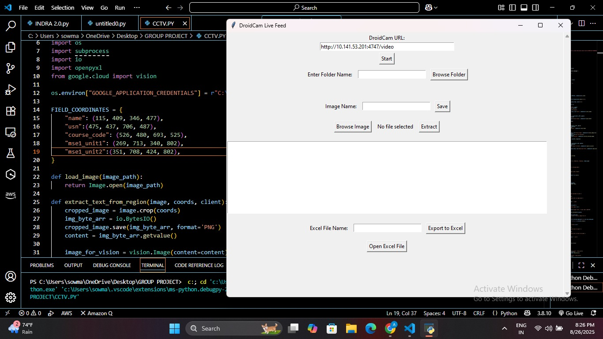
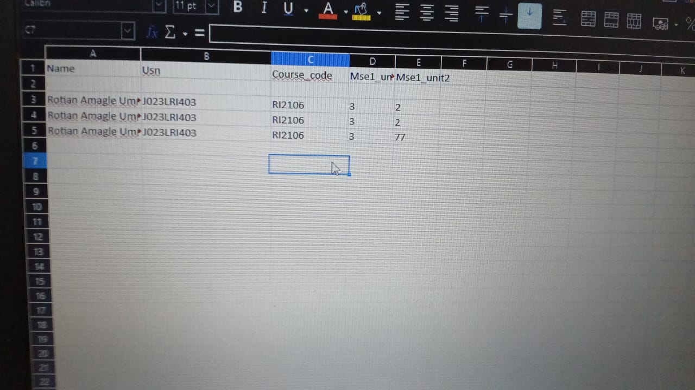
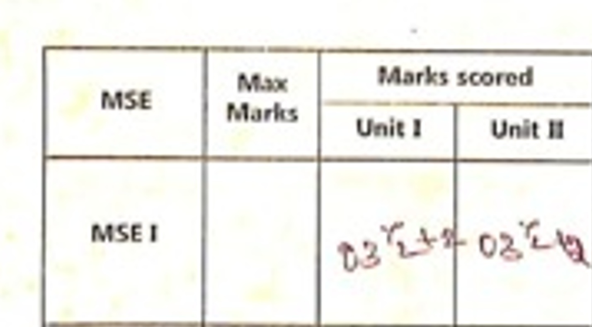
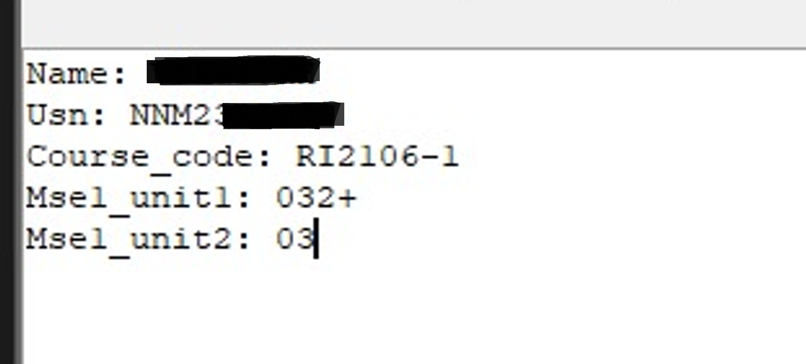

# 📄 Report Card Data Extractor

A Python desktop application that digitizes physical report cards using a live camera feed and Google Cloud Vision OCR. It captures an image via DroidCam, extracts a fixed set of fields from predefined regions of the card, and appends the results to an Excel spreadsheet.

> **Note:** This tool is built for a specific report card layout. It extracts text from fixed pixel coordinates on the captured image, so it works reliably only when every card is scanned at the same resolution, orientation, and layout. It is not a general-purpose document parser.

## Features
* **Live Camera Feed** — Streams video from a phone via the DroidCam app using OpenCV.
* **Fixed-Region OCR** — Extracts a defined set of fields (Name, USN, one course code, two MSE-1 unit marks) from set coordinates using Google Cloud Vision's text detection.
* **Simple GUI** — Built with Tkinter: connect to the camera, capture or browse an image, preview extracted text, and export.
* **Excel Export** — Appends each extraction as a new row to a `.xlsx` file via openpyxl, creating the file with headers if it doesn't exist yet.



## Technologies Used
* **Language:** Python
* **Computer Vision:** OpenCV (`cv2`)
* **OCR:** Google Cloud Vision API
* **GUI:** Tkinter, Pillow (`PIL`)
* **Data Export:** openpyxl

---

## Setup and Installation

### 1. Prerequisites
* Python 3.8+
* [DroidCam](https://www.dev47apps.com/) installed on your phone (for the camera feed)
* A Google Cloud account with the **Cloud Vision API** enabled and billing set up (the API is not free beyond a limited monthly quota)

### 2. Install Dependencies
Clone the repository, then from the project folder run:

```bash
pip install opencv-python pillow openpyxl google-cloud-vision
```

### 3. Configure Authentication
This app reads your Google Cloud service account credentials from an environment variable — never hardcode the key path or commit the JSON file.

1. Create a Google Cloud Service Account and download its JSON key.
2. Store the key somewhere outside this project folder.
3. Set the environment variable before running the app:

**Windows (PowerShell):**
```powershell
$env:GOOGLE_APPLICATION_CREDENTIALS="C:\path\to\your\service-account-key.json"
```

**Linux/macOS:**
```bash
export GOOGLE_APPLICATION_CREDENTIALS="/home/user/path/to/your/service-account-key.json"
```
This needs to be set every new terminal session, or added to your shell profile to persist.

### 4. Run the Application
```bash
python app.py
```

---

## Usage

1. Open the app and enter your DroidCam stream URL (shown in the DroidCam mobile app), then click **Start** to begin the live feed.
2. Once the report card is framed correctly in view, enter an image name and click **Save** to capture the current frame — or click **Browse Image** to use an existing photo instead.
3. Click **Extract** to run OCR on the fixed field regions. Results appear in the text box.
4. Enter an Excel file name and click **Export to Excel** to append the row. If the file already exists, a new row is added; otherwise a new file is created with headers.
5. Use **Open Excel File** or **Browse Folder** to jump straight to your saved output.

Captured images and exported spreadsheets are saved under `~/OneDrive/Desktop/<folder name>` (defaults to `DroidCamFrames` if left blank).

## Example Extraction
Multiple test rows extracted and exported successfully under good lighting and legible handwriting:



Accuracy drops when handwriting includes corrections or overlapping strokes — in one case a corrected mark was read as `032+`:

 

## Known Limitations
* **Windows-oriented file paths.** Output folders are written under `~/OneDrive/Desktop`, which assumes a Windows machine with OneDrive. On macOS/Linux this will create an `OneDrive/Desktop` path that may not otherwise exist.
* **Single fixed layout.** Field coordinates are hardcoded to one report card template. A different card layout, scan resolution, or camera angle will misalign or fail extraction.
* **OCR accuracy varies** with lighting, image sharpness, and handwriting vs. printed text.
* **No corner-case handling in export.** Field values containing a colon (`:`) could break the text-box-to-Excel parsing.

## Project Structure
```text
.
├── docs/           # Documentation assets and sample extraction images
├── .gitignore      # Ignored files and sensitive credentials
├── LICENSE         # Project license terms
├── README.md       # Project documentation and setup instructions
└── app.py          # Main application: GUI, camera feed, OCR extraction, Excel export

## Contributing
Contributions are welcome. Please do not commit credential files (`*.json`, `.env`, `*.key`, `*.pem`) — these are already excluded via `.gitignore`.
